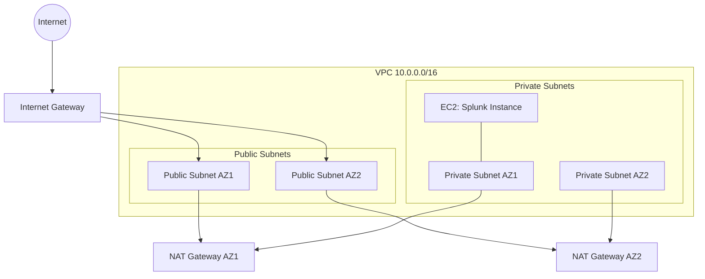

# Lincoln 🎩


Build a Splunk-ready Amazon Linux 2023 AMI with Packer and deploy a secure AWS VPC with Terraform — complete with private subnets, NAT egress, and Session Manager access.

## ✨ What’s Inside

- 🧰 Packer: Builds an AL2023 AMI with SSM Agent and Splunk installed by default (override `splunk_wget_url` to disable). Root EBS for the AMI is 128 GB gp3.
- 🏗️ Terraform: Provisions a VPC across 2 AZs, public/private subnets, IGW, NAT Gateways, IAM role/profile for SSM, security groups, and one or more EC2 instances in private subnets.
- 🔐 Access: Connect via AWS Systems Manager Session Manager (through NAT — no public IPs required).

## 🗺️ Architecture (High Level)



SSM traffic from the private instance reaches AWS via the NAT Gateways.

## 📁 Repo Layout

```
.
├── packer/
│   └── splunk-al2023.pkr.hcl   # AL2023 AMI build (Splunk steps commented)
└── terraform/
    ├── main.tf                 # Provider + default tags
    ├── variables.tf            # Inputs with validations and toggles
    ├── data.tf                 # AMI lookup (matches Packer AMI)
    ├── vpc.tf                  # VPC, subnets, routes, NAT
    ├── sg.tf                   # Security groups
    ├── iam.tf                  # SSM role + instance profile
    ├── ec2.tf                  # Private EC2 instance (SSM-enabled)
    ├── outputs.tf              # Useful outputs (incl. SSM command)
    └── user_data.sh            # Boots the instance and sets hostname
```

Additional build assets

```
packer/files/Splunkd.service     # Optional systemd unit for Splunk
packer/scripts/splunk_setup.sh   # Consolidated Packer provisioner script
```

## ✅ Prerequisites

- AWS account and credentials configured (`aws sts get-caller-identity` works)
- Terraform >= 1.6
- Packer (if you plan to build the AMI)
- AWS CLI + Session Manager plugin (for connecting via SSM)

## ⚙️ Quickstart

1) Build the AMI with Packer

```bash
cd packer
packer init .
packer build -var "region=us-east-1" splunk-al2023.pkr.hcl
```


Notes:
- Splunk is installed by default. To skip Splunk, pass an empty URL: `-var 'splunk_wget_url='`.
- To pin a different Splunk version, set both `splunk_version` and `splunk_wget_url` accordingly.

2) Deploy infrastructure with Terraform

```bash
cd terraform
terraform init
terraform plan
terraform apply
```

3) Connect to the instance(s) via SSM

```bash
terraform output ssm_connect_commands
# Example:
# [
#   "aws ssm start-session --target i-xxxxxxxx --region us-east-1",
#   "aws ssm start-session --target i-yyyyyyyy --region us-east-1"
# ]

# Or just the first instance:
terraform output ssm_connect_command
```

## 🔧 Configuration Highlights

- AMI discovery: Looks up your latest Packer-built AMI by name wildcard.
- AMI root volume: 128 GB gp3 (encrypted), set at build time.
- Subnets: Generated with `cidrsubnet` from the VPC CIDR.
- EC2 hardening: IMDSv2 optional/required, optional detailed monitoring, optional termination protection, burst credit control for T-family.
- Default tags: Set centrally in the provider.
- Hostnames: `user_data.sh` sets the Linux hostname from the instance `Name` tag.

## 🛡️ Security Notes

- Instances live in private subnets with no public IPs.
- Session Manager provides shell access without inbound openings.
- Root EBS volume uses encryption and GP3 by default.
- To go fully private (no NAT), add SSM interface endpoints (ssm, ssmmessages, ec2messages) and remove NAT Gateways.

## 💸 Cost Considerations

- NAT Gateways incur hourly and data processing fees (x2 in this config).
- Consider reducing to a single AZ for dev to cut costs.

## 🧹 Cleanup

```bash
cd terraform
terraform destroy
```

If you built AMIs with Packer, de-register AMIs and delete snapshots you no longer need.

---

Questions or ideas? Open an issue or tweak the variables and go! ✨
